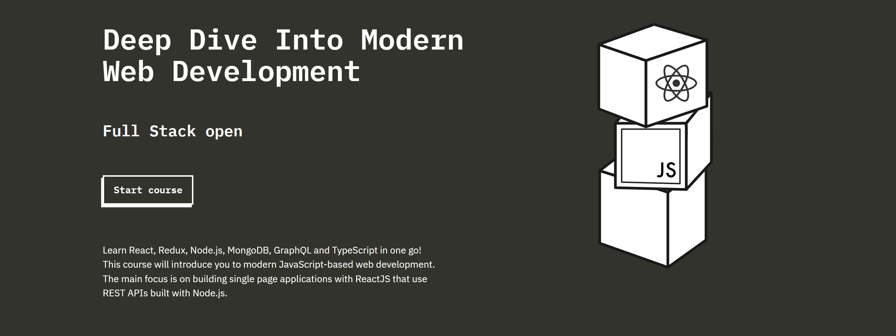

<h1 align="center"> Full Stack Web Development Course </h1>

Learn React, Redux, Node.js, MongoDB, GraphQL and TypeScript in one go! This course will introduce you to modern JavaScript-based web development. The main focus is on building single page applications with ReactJS that use REST APIs built with Node.js.

---
---

## Introduction:

This repository will contain the solutions for the exercises and projects of the Full Stack Web Development course:

- **[Course Website](https://fullstackopen.com/en/)**
- **[Course Repository](https://github.com/fullstack-hy2020/fullstack-hy2020.github.io)**

---
---

## Course Content:

- **[Part 0 - Fundamentals of Web apps](./part0)**
- **[Part 1 - Introduction to React](./part1)**
- **[Part 2 - Communicating with server](./part2)**
- **[Part 3 - Programming a server with NodeJS and Express](./part3)**
- **[Part 4 - Testing Express servers, user administration](./part4)**
- **[Part 5 - Testing React apps](./part5)**
- **[Part 6 - Advanced state management](./part6)**
- **[Part 7 - React router, custom hooks, styling app](./part7)**
- **[Part 8 - GraphQL](./part8)**
- **[Part 9 - TypeScript](./part9)**
- **[Part 10 - React Native](./part10)**
- **[Part 11 - CI/CD](./part11)**
- **[Part 12 - Containers](./part12)**
- **[Part 13 - Using relational databases](./part13)**

---
---

## Contact:

- Javier Velasco: <**<Jvlsc@proton.me>**>

---
---