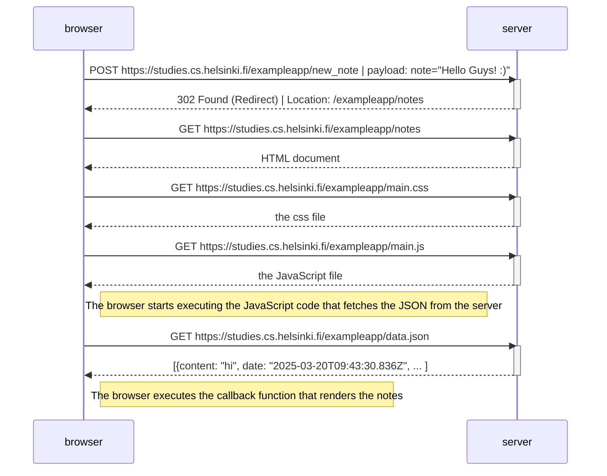

# Exercise 0.4: New note diagram

Create a diagram depicting the situation where the user creates a new note on the page https://studies.cs.helsinki.fi/exampleapp/notes by writing something into the text field and clicking the Save button.

---
---

## Process:

1. The user navigates to the page: [Link](https://studies.cs.helsinki.fi/exampleapp/notes).
2. The user writes "Hello Guys! :)" into the text field of the `POST` request form and clicks the `Save` button:

    

3. The new note is saved to the server and the user is redirected to the page again displaying the new created note:
    

    

---
---

## Diagram:

---
---

## Conclusion:

The diagram above shows the process of the user creating a new note in a traditional web application. The problem with this approach is that the page is reloaded once the new note is created, producing 5 HTTP requests and bad user experience.

---
---