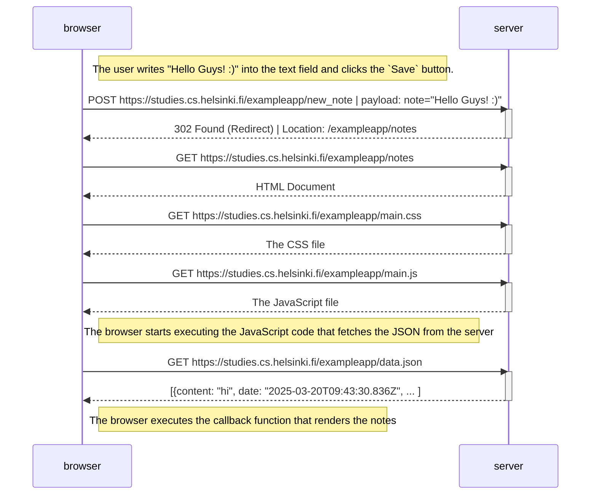

# Exercise 0.4: New note diagram

Create a diagram depicting the situation where the user creates a new note on the [Traditional Web Application](https://studies.cs.helsinki.fi/exampleapp/notes).

---
---

## Table of Contents:

- [Process](#process)
- [Diagram](#diagram)
- [Conclusion](#conclusion)

---
---

## Process:

1. The user navigates to the [notes page](https://studies.cs.helsinki.fi/exampleapp/notes) where the browser loads HTML, CSS, JavaScript, and the existing notes data.

2. The user enters `Hello Guys! :)` into the text field and clicks the `Save` button, submitting the form:

    

3. The form submission initiates the following sequence:
   - The browser sends a `POST` request to the server's `/exampleapp/new_note` endpoint.
   - The server processes the new note, adds it to its data storage.
   - The server responds with a `302` status code, redirecting the browser back to the notes page.
   - The browser reloads the entire page, requesting all resources again.
   - The updated list of notes (including the new one) is displayed:

    

    

---
---

## Diagram:

---
---

## Conclusion:

This diagram illustrates the traditional web application approach to handling form submissions. Key observations:

- **User experience**: The server responds with a redirect (`HTTP 302`), so the entire page must reload after form submission.
- **Network traffic**: Five `HTTP` requests are required to reload all resources (HTML, CSS, JavaScript, data) after creating a new note.

---
---