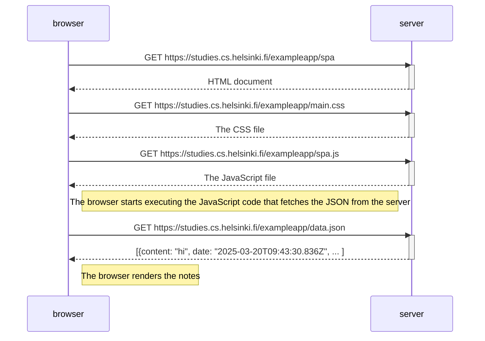

# Exercise 0.5: Single page app diagram

Create a diagram depicting the situation where the user goes to the [Single Page App](https://studies.cs.helsinki.fi/exampleapp/spa) version of the notes app.

---
---

## Table of Contents:

- [Process](#process)
- [Diagram](#diagram)
- [Conclusion](#conclusion)

---
---

## Process:

1. The user navigates to the [notes page](https://studies.cs.helsinki.fi/exampleapp/spa) (`GET` request):

    

2. The browser parses the HTML and requests the additional resources required by the page (`GET` requests):
   - The CSS file (`main.css`) for styling
   - The JavaScript file (`spa.js`) containing the SPA functionality

    
    
    

3. The browser executes the JavaScript code in `spa.js`, which:
   - Makes an asynchronous `GET` request to fetch the notes data.
   - Parses the received `JSON` data.
   - Dynamically renders the notes to the `DOM` without page reloading.

    
    
    

---
---

## Diagram:

---
---

## Conclusion:

This diagram illustrates the key characteristics of a `Single Page Application (SPA)`. The initial loading process is similar to a traditional web application, but the fundamental difference emerges afterward: the page doesn't reload when interacting with or displaying content. Instead, the `JavaScript` code fetches data asynchronously and renders it dynamically on the client side.

---
---