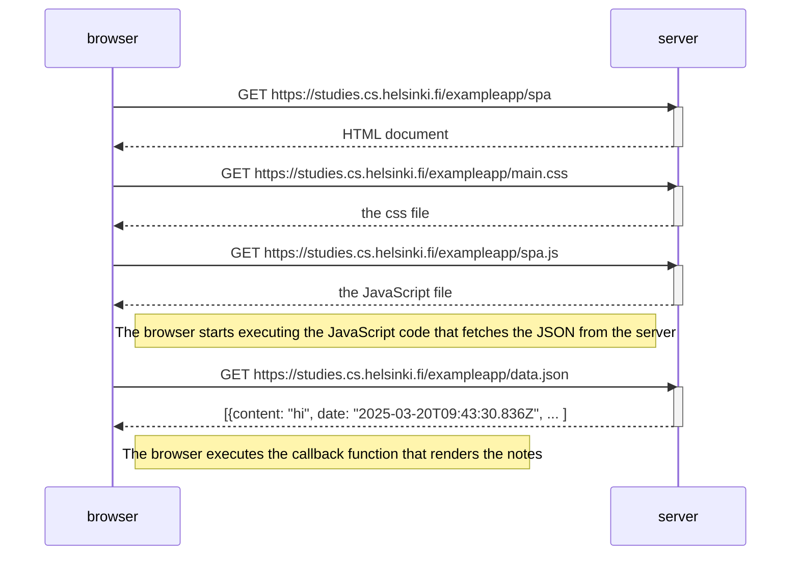

# Exercise 0.5: Single page app diagram

Create a diagram depicting the situation where the user goes to the single-page app version of the notes app at https://studies.cs.helsinki.fi/exampleapp/spa.

---
---

## Process:

1. The user navigates to the [page](https://studies.cs.helsinki.fi/exampleapp/spa) (GET request):

    

2. The page requests the `main.css` and `spa.js` files (GET requests):

    
    
    

3. The `spa.js` file requests the `JSON` data (GET request) and renders the notes:

    
    

---
---

## Diagram:

---
---

## Conclusion:

The diagram above shows the process of the user going to the Single Page App version of the notes app. The process is similar to the traditional web application.

---
---