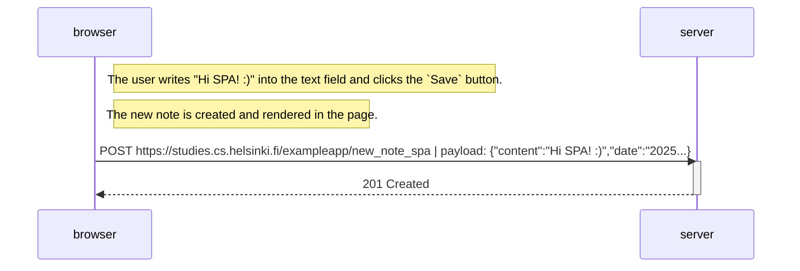

# Exercise 0.6: New note in Single page app diagram

Create a diagram depicting the situation where the user creates a new note using the [Single Page App](https://studies.cs.helsinki.fi/exampleapp/spa) version of the notes app.

---
---

## Process:

1. The user creates a new note by entering `Hi SPA! :)` into the text field and clicking the `Save` button:

    

2. The `spa.js` file, when the DOM is fully loaded, adds a handler to the form's `submit` event that:
    - Prevents the default form behavior (page reload).
    - Extracts the content from the text field.
    - Creates a new note object with the content and current date.
    - Adds the note to the existing notes array.
    - Clears the input field to allow for new notes.
    - Updates the user interface with the `redrawNotes()` function.
    - Sends the new note to the server using the `sendToServer()` function (step 3).

    
    

3. To send the new note to the server, the `spa.js` file performs the following actions:
   - Constructs a `POST` request to the `/exampleapp/new_note_spa` endpoint.
   - Sets the `Content-Type` header to `application/json`.
   - Converts the note object to a `JSON` string and sends it as the request payload.
   - The server processes the request and responds with a `201 Created` status.

    
    
    

---
---

## Diagram:

---
---

## Conclusion:

The diagram illustrates the process of creating a new note in a `Single Page Application (SPA)`. The key difference from traditional web applications are:

- **Enhances user experience** by rendering the new note immediately without reloading the page.
- **Reduces network traffic** by only sending/receiving necessary data (1 HTTP request instead of 5).

---
---
