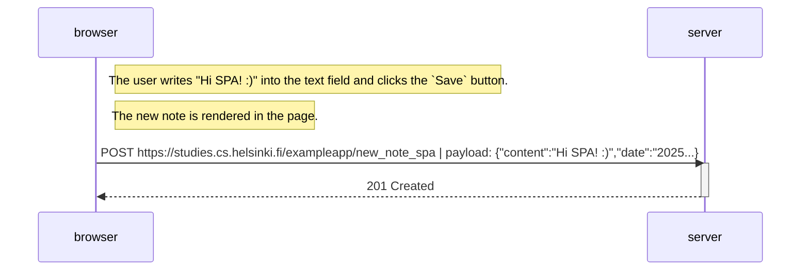

# Exercise 0.6: New note in Single page app diagram

Create a diagram depicting the situation where the user creates a new note using the single-page version of the app.

---
---

## Process:

1. The user creates a new note using the [single-page](https://studies.cs.helsinki.fi/exampleapp/spa) version of the app and writes "Hi SPA! :)" into the text field and clicks the `Save` button:

    

2. The `spa.js` file, when the DOM is fully loaded, captures the notes form using its ID `notes_form` and adds a handler to the form's `submit` event that:
    - Prevents the default form behavior (page reload).
    - Extracts the content from the text field.
    - Creates a new note object with the content and current date.
    - Adds the note to the existing notes array.
    - Clears the input field to allow for new notes.
    - Updates the user interface with the `redrawNotes()` function.
    - Sends the new note to the server using the `sendToServer()` function (step 3).

    
    

3. To send the new note to the server, the `spa.js` file sends a `POST` request to the `/exampleapp/new_note_spa` endpoint:

    
    
    

---
---

## Diagram:

---
---

## Conclusion:

The diagram above shows the process of the user creating a new note using the single-page version of the app. The difference between this process and the traditional web application is that the new note is rendered in the page without reloading the page improving the user experience and reducing the number of `HTTP` requests to a simple `POST` request.

---
---
